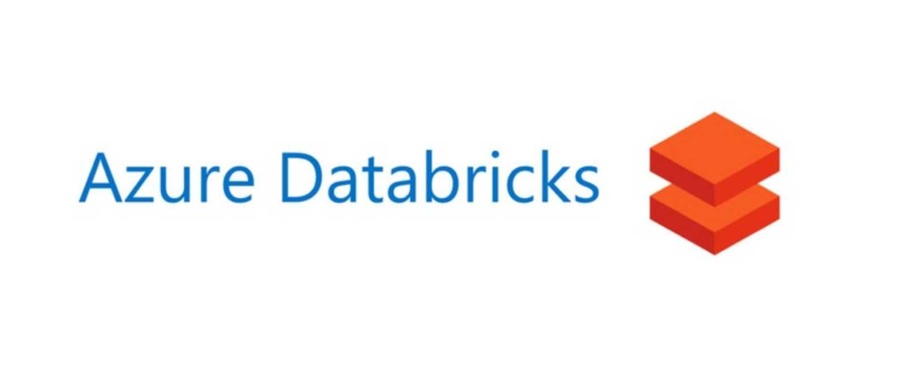

# Google Playstore Reviews Data Analysis Project

## Introduction
This project focuses on analyzing Google Playstore reviews data using Azure Databricks. The goal is to gain insights from the data by performing data ingestion, transformation, and analysis using PySpark and SQL queries within a Databricks notebook.

## Table Of Contents
1. Data Ingestion
   - Cluster Setup
   - Uploading File into DBFS
   - Opening New Notebook and Connecting the File

2. Data Transformation
   - Handling Null Values
   - Adjusting Data Types

3. Data Analysis
   - Top 10 Reviews Analysis

## Data Ingestion
### Cluster Setup
To begin the project, a Databricks cluster was set up to facilitate data processing and analysis. The cluster configuration was optimized based on the project's requirements.

### Uploading File into DBFS
The Google Playstore reviews dataset was uploaded into the Databricks File System (DBFS). This allowed for easy access and manipulation of the data within the Databricks environment.

### Opening New Notebook and Connecting the File
A new notebook was created within Databricks to house the data analysis process. The notebook was connected to the uploaded dataset in DBFS, enabling seamless interaction with the data.

## Data Transformation
### Handling Null Values
Upon initial inspection, it was observed that the dataset contained null values. These null values were addressed using PySpark's capabilities to clean the data, ensuring the accuracy and reliability of subsequent analysis.

### Adjusting Data Types
The data types in the dataset were reviewed, and inconsistencies were identified between the expected data types and the actual values present. Using PySpark, the data types were adjusted to match the values, eliminating potential errors in the analysis process.

## Data Analysis
### Top 10 Reviews Analysis
One of the key analysis goals was to determine the top 10 reviews from the dataset. This was achieved using SQL queries within the Databricks notebook. By querying the dataset based on relevant criteria (e.g., review ratings, helpfulness), the top 10 reviews were identified and extracted for further examination.

## Conclusion
This Google Playstore reviews data analysis project successfully demonstrated the process of working with data in Azure Databricks. By following the steps of data ingestion, transformation, and analysis, valuable insights were derived from the dataset. The project showcases how Databricks, PySpark, and SQL queries can be combined to perform meaningful analysis on real-world data.

For further details, refer to the Databricks notebook associated with this project.
